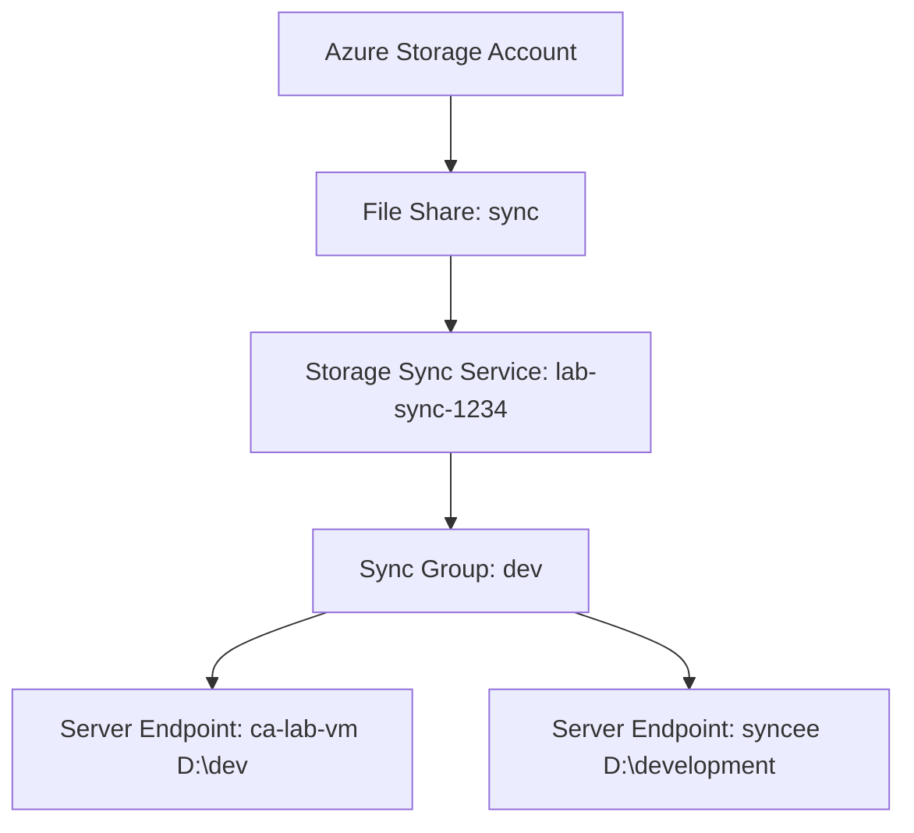

# 🔄 Azure File Sync – End-to-End Deployment Lab

This project documents a full deployment and configuration of **Azure File Sync** using the Azure Portal. It includes setting up a Storage Sync Service, file shares, multiple Windows Server VM endpoints, and synchronization validation.

📚 **Part of my AZ-104: Azure Administrator certification preparation**

---

## 📦 Overview

| Component               | Description                                                   |
|------------------------|---------------------------------------------------------------|
| 🔁 Sync Service         | `lab-sync-1234` (Storage Sync Service in West US)             |
| ☁️ File Share           | `sync` (Azure Files, cloud endpoint)                          |
| 🖥️ Server Endpoints     | `ca-lab-vm` and `syncee` (Windows Server VMs in Azure)         |
| ⚙️ Cloud Tiering        | Enabled with 30-day access cache + 50% disk space reservation |
| 🔐 NSG Rules            | HTTPS (443) enabled for sync communication                    |
| 📂 Storage Sync Agent  | Installed and configured on both servers                      |

> Screenshots available in the [`/screenshots`](./screenshots) folder.

---

## 🛠️ What I Did

### ✅ 1. Deploy Azure File Sync Service
- Created **Storage Sync Service** (`lab-sync-1234`) in West US
- Used **Resource Group**: `cal-1294-fea`

### ✅ 2. Create File Share
- Opened existing **storage account**: `calabsynccal1294fea`
- Created file share named `sync`

### ✅ 3. Create Sync Group
- Created sync group `dev`
- Linked it to the `sync` file share as cloud endpoint

### ✅ 4. Install and Configure Sync Agent on VMs
- Accessed VM `ca-lab-vm` via **Remote Desktop (RDP)**
- Installed **Azure File Sync Agent**
- Registered server with sync service
- Repeated same steps on second VM `syncee`

### ✅ 5. Add Server Endpoints
- On `ca-lab-vm`: Added endpoint at `D:\dev`
- On `syncee`: Added endpoint at `D:\development`
- Enabled **Cloud Tiering** (30 days cache, 50% free disk space)

### ✅ 6. File Sync Testing
- Created files in `D:\dev`, confirmed sync to Azure Files
- Verified replication to `D:\development` on second VM
- Renamed/tested file movement and observed tiered sync behavior

---

## 📁 Folder Structure

